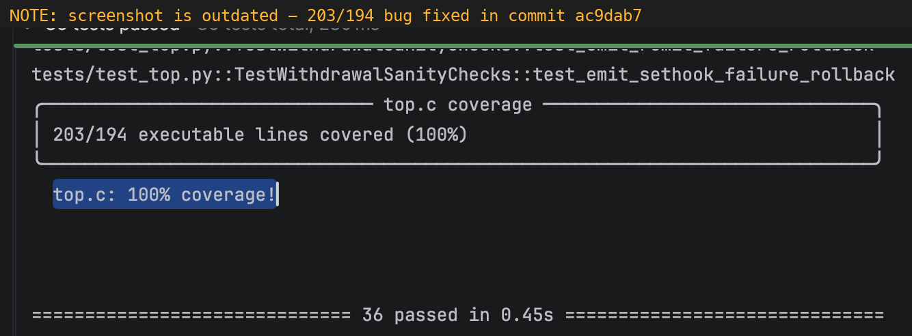

# hookz



**Experimental.** Test framework for [Xahau](https://xahau.network) WASM hooks. Execute C hooks in Python, get line-level coverage, explore the hook API — without running xahaud.

## Why

There are several ways to test Xahau hooks today:

| Approach | Build | Feedback | Coverage | Trace |
|----------|-------|----------|----------|-------|
| Official live/testnet | N/A | 3-4s per ledger close | None | Log scraping |
| Standalone xahaud | Touched a header? Minutes | 3-4s per ledger close | None | Log scraping |
| xahaud C++ test env (`Env`) | Touched a header? Minutes | ~1s per ledger close | C++ only (gcov) | Buried in journal |
| **hookz** | **~1s (WASM compile)** | **Milliseconds** | **Line-level C source** | **Structured + clickable** |

Multi-ledger scenarios (governance votes, settlement, cleanup) compound those per-ledger waits.

- hookz runs hooks in Python via wasmtime with mocked host functions
- All 68 hook API functions implemented (expect bugs/dragons for a while)
- Full power of Python and pytest for setup, assertions, parametrization
- `hookz show` lets you (or AI agents) look up the C++ source for any host function
- `/impl-handler` skill teaches agents to port handlers and write tests
- Designed for fast iteration — write a test, see coverage, fix the hook, repeat

For integration testing against real xahaud, see [xahaud-scripts](https://github.com/sublimator/xahaud-scripts).


## Using hookz

### Prerequisites

- [uv](https://docs.astral.sh/uv/)
- [wasi-sdk](https://github.com/nicholasdudfield/xahaud-scripts) (C to WASM compiler — `mise install wasi-sdk`)
- A checkout of [xahaud](https://github.com/nicholasdudfield/xahaud-scripts) (for hook headers)
- A checkout of hookz

### Setup

```bash
mkdir -p ~/projects && cd ~/projects
git clone <hookz-repo> hookz
git clone <xahaud-repo> xahaud

# Start a new hook project
mkdir dao-hook && cd dao-hook
uv init
uv add hookz --editable ../hookz
uv add pytest
```

### Configure

Create `hookz.toml` in your project root:

```toml
[paths]
xahaud = "../xahaud"
wasi_sdk = "~/.local/share/mise/installs/wasi-sdk/32/wasi-sdk"

[hooks]
dao = "src/dao.c"
```

All `[paths]` entries support `${var}` substitution, `~` expansion, and `HOOKZ_<KEY>` env var overrides.

For machine-specific overrides (different wasi-sdk path, etc.), create `.hookz.local.toml` — same format, not committed.

### Write tests

```python
# tests/conftest.py
from hookz.testing import register_hooks_from_config
register_hooks_from_config()
```

```python
# tests/test_my_hook.py
from hookz.runtime import HookRuntime
from hookz import hookapi

def test_outgoing_passes(dao_hook):
    rt = HookRuntime()
    rt.hook_account = b"\x01" * 20
    rt.otxn_account = rt.hook_account  # same = outgoing
    rt.otxn_type = hookapi.ttINVOKE
    result = rt.run(dao_hook)
    assert result.accepted

def test_non_member_rejected(dao_hook):
    rt = HookRuntime()
    rt.hook_account = b"\x01" * 20
    rt.otxn_account = b"\x02" * 20
    rt.otxn_type = hookapi.ttINVOKE
    result = rt.run(dao_hook)
    assert result.rejected
    assert b"not a member" in result.return_msg
```

The `dao_hook` fixture is auto-generated from `[hooks] dao = "src/dao.c"`. It compiles, instruments, and caches the WASM.

### Run

```bash
uv run hookz test                             # run all tests
uv run hookz test -k "test_outgoing"          # filter
uv run hookz test -sv                         # verbose + see print output
HOOKZ_TRACE=1 uv run hookz test -sv          # see hook trace output
```

### Try the included example

```bash
cd ~/projects/hookz/examples/tipbot
uv sync
uv run hookz test
```

## CLI

```
hookz test [pytest args...]          Run tests
hookz build hook.c                   Production build (compile + optimize + clean + guard-check)
hookz wce hook.c                     WCE budget analysis with per-loop breakdown
hookz wce --source hook.c            Annotated source with per-line WCE cost
hookz guard-check hook.wasm          Validate guard calls and show WCE
hookz clean hook.wasm                Clean WASM for deployment (strip + rewrite guards)
hookz show float_multiply            Show C++ source + xahaud test vectors
hookz show --list                    All 68 functions: implemented vs stub
hookz coverage                       Tests + uncovered line report
hookz find-tests tip.c:225-400       Which tests cover these lines?
hookz debug-compile hook.c           Debug build for testing (not for deployment)
```

## Production builds

`hookz build` produces deployment-ready WASM from C source in one command:

```bash
hookz build reward.c
  Compiling reward.c...
    Compiled: 3463 bytes
    Optimized: 3463 → 3460 bytes        # wasm-opt, if available
    Cleaned: 3460 → 3171 bytes          # strip sections, rewrite guards
    Guard check PASSED (hook WCE=9,029 — 13.8% of budget)
    → reward.wasm (3171 bytes)
```

The cleaner (Python port of [hook-cleaner-c](https://github.com/nicholasdudfield/hook-cleaner-c)) strips custom sections, rebuilds exports to only `hook`/`cbak`, rewrites guard calls to canonical loop-top form, and remaps type indices. The guard checker (port of xahaud `Guard.h`) validates the result.

## WCE analysis

`hookz wce` shows where your execution budget goes:

```bash
hookz wce govern.c

  govern.c — Worst-Case Execution Analysis
    hook() WCE: 32,849 / 65,535 (50.1%)  ██████████░░░░░░░░░░
      line 722  GUARD(3    )  23,988 instrs  ██████████████░░░░░░  73.0%
      line 724  GUARD(67   )   7,973 instrs  ████░░░░░░░░░░░░░░░░  24.3%
      line 279  GUARD(21   )   2,478 instrs  █░░░░░░░░░░░░░░░░░░░   7.5%
```

Add `--source` for annotated source with per-line cost. Source lines are extracted from guard IDs (`_g` macro encodes `__LINE__`). Per-loop WCE totals are exact from the guard checker.

## Ledger model

Hooks that look up accounts or trust lines via keylets work without mocking:

```python
from hookz.ledger import account_root

kl, data = account_root("rBob...", Balance="50000000")
rt.ledger[kl] = data
result = rt.run(hook)  # hook's util_keylet + slot_set just works
```

20+ keylet functions matching xahaud exactly (verified against rippled). `slot_set` with a 34-byte keylet automatically looks up `rt.ledger`. `slot_subfield`/`slot_count`/`slot_subarray` parse real serialized data.

## Traces

Hooks call `trace`, `trace_num`, and `trace_float` host functions (some hooks wrap these with macros like `TRACEVAR`/`TRACEHEX`). hookz captures these with source line numbers:

```
[hook] tip.c:227  member_count: 3
[hook] tip.c:228  threshold: 2
[hook] tip.c:320  current_ledger: 100
```

Set `HOOKZ_EDITOR=clion` (or `pycharm`, `idea`, any JetBrains IDE) for clickable links that open your editor at the right line. Custom: `HOOKZ_EDITOR='@myscheme://%file:%line'`.


## Coverage

hookz instruments WASM via DWARF debug info, then uses tree-sitter to filter non-executable lines (comments, braces, declarations). You get real coverage of real C code:

```
┌─────────── tip.c coverage ───────────────────────┐
│ 201/201 executable lines covered (100%)           │
└───────────────────────────────────────────────────┘
  tip.c: 100% coverage!

┌─────────── top.c coverage ───────────────────────┐
│ 194/194 executable lines covered (100%)           │
└───────────────────────────────────────────────────┘
  top.c: 100% coverage!
```

## Developing hookz

### Setup

```bash
cd ~/projects/hookz
uv sync
```

### Run framework tests

```bash
uv run pytest tests/                  # framework tests (570+ tests)
uv run pytest tests/test_handlers/    # handler unit tests
uv run pytest tests/test_wasm.py      # WASM decode/encode/guard/clean tests
```

### Run e2e tests (Xahau genesis hooks + community hooks)

```bash
cd tests/e2e
uv run hookz test                     # 100+ tests across 13 hooks
```

### Run example tests

```bash
cd examples/tipbot
uv sync
uv run hookz test                     # 62 tests, both hooks 100% coverage
```

### Implement a handler

```bash
# See what's unimplemented
uv run hookz show --list | grep "✗"

# Look up the C++ source
uv run hookz show float_multiply

# Add to src/hookz/handlers/float.py — auto-discovered
```

Handlers are plain functions: `def name(rt: HookRuntime, *wasm_args) -> int`. Drop one in `handlers/`, it works.

For AI agents: `/impl-handler float_multiply` runs the full workflow.

### Project layout

```
src/hookz/
  runtime.py              WASM executor + ledger model
  handlers/               68 auto-discovered host functions
  wasm/                   WASM binary manipulation:
    types.py                internal Module representation
    decode.py               WASM → Module (via wasm-tob)
    encode.py               Module → WASM (LEB128 writer)
    guard.py                guard checker + WCE analysis
    clean.py                cleaner (strip, rewrite guards, rebuild exports)
    optimize.py             wasm-opt CLI wrapper
    visitor.py              pluggable visitor for clean decisions
  coverage/               DWARF rewriter + AST-aware tracker
  xrpl/                   txn parser, xahaud source extraction
  ledger.py               keylet computation + ledger object builders
  testing/                pytest plugin + fixture generation
  cli/                    hookz CLI
  xfl.py                  XFL <-> float
  account.py              accid <-> r-address
  editor.py               clickable trace links
  hookapi.py              482 auto-generated constants
examples/
  tipbot/                 self-contained example (62 tests, 100% coverage)
tests/
  test_handlers/          handler unit tests (530+ tests)
  test_wasm.py            WASM package tests (decode, encode, guard, clean)
  e2e/                    end-to-end hook tests:
    hooks/genesis/          xahaud genesis hooks (govern, mint, nftoken, reward)
    hooks/misc/             custom hooks (balance_gate, treasury)
    hooks/XahauHooks101/    community hook examples (submodule)
```
